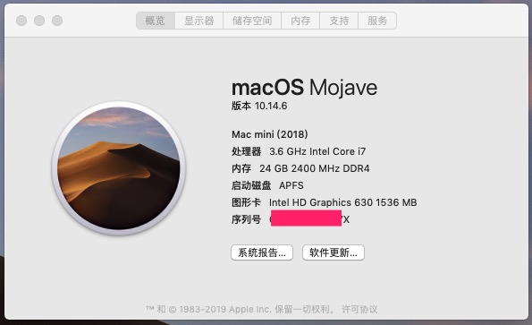
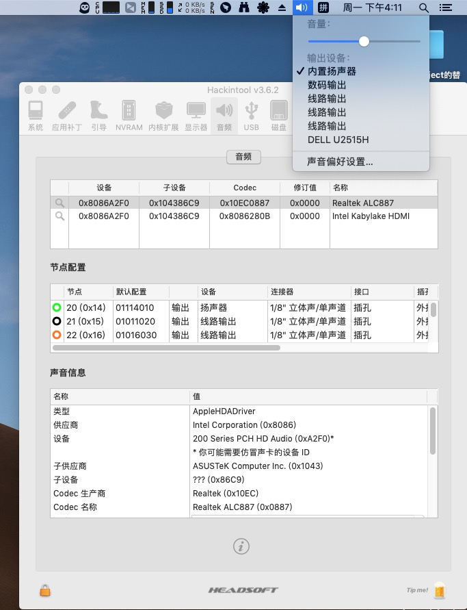
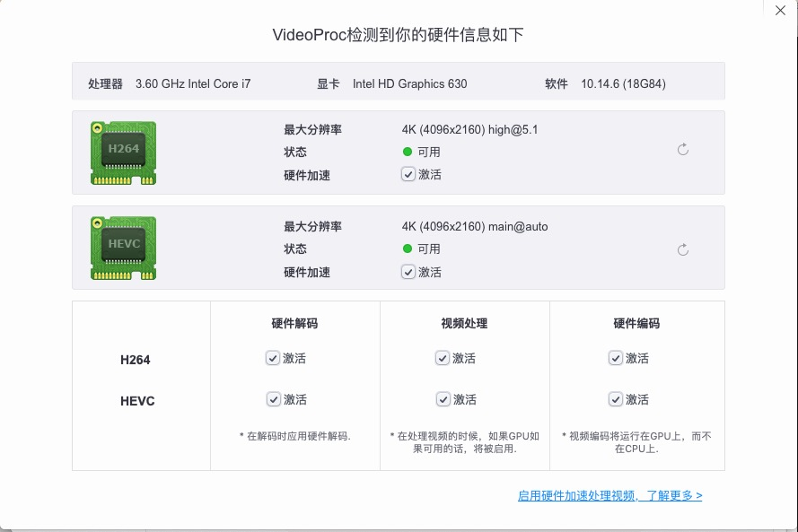

#### System Info

 
##### 说明

测试，安装学习，理论支持其它新旧版本

##### macOS Mojave 10.14.6（18G84）

```
主板：ASUS B250M PLUS
CPU:  i7-7700 @3.60GHz （集显U630）
显示器：DELL U2515H
macOS版本：10.14.6（17G66）（dmg镜像大小5.6G左右）
内置声卡：Realtek ALC887
```

##### 正常使用

```
1、集显输出，使用外接显示器HDMI显示。

2、主机前后音频插口正常。

3、显示器HDMI接口支持音频输出，不支持音量调节。

4、休眠，唤醒，关机正常。

5、流畅，不卡屏、闪屏
```


##### 使用说明

复制efi，集显HDMI插口，安装系统。


##### 主板集成声卡ALC887 + 显示器音频输出



 

##### 集显硬件加速

VideoProc测试硬件加速，可以检测到支持。




